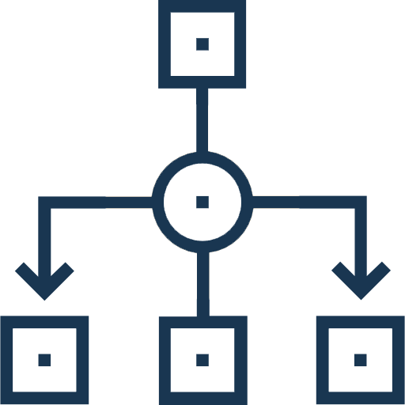

### *Русский*

# Фильтрация массива строк

Этот проект является итоговой контрольной работой по основному блоку обучения "Разработчик. Основной блок" в GeekBrains. Работа направлена на проверку знаний и навыков, полученных в ходе обучения, и представляет собой программу на языке C#, которая принимает массив строк и возвращает новый массив, содержащий только те строки, длина которых не превышает 3 символа. Массив строк может быть введен пользователем или задан заранее в коде.

## Рабочий процесс

Программа начинается с интерактивного пользовательского интерфейса, представленного в виде меню. Пользователь выбирает массив для обработки, после чего программа приступает к фильтрации. Результаты затем отображаются на экране.

## Описание алгоритма

### Алгоритм

1. **Отображение меню**: Пользователю предлагается выбор из нескольких предопределенных массивов или возможность ввести собственный массив.

2. **Чтение выбора пользователя**: Программа регистрирует выбор пользователя и устанавливает соответствующий массив для дальнейшей обработки или ожидает ввод элементов массива пользователя через пробел.

3. **Фильтрация массива**: Программа вызывает функцию `FilterArray()`, которая проходит по всем элементам исходного массива и создает новый массив, содержащий только те строки, длина которых не превышает 3 символа.

4. **Вывод результата**: Программа выводит элементы полученного массива. Если полученный массив пуст, программа выводит сообщение о том, что ни один из элементов исходного массива не подходит под условие.

## Установка и запуск

Чтобы запустить программу, выполните следующие шаги:

1. Клонируйте репозиторий на свой компьютер.
2. Откройте проект в среде разработки, поддерживающей C# (например, в Visual Studio Code).
3. Запустите программу.

## Лицензия

Этот проект лицензирован под условиями лицензии MIT.

---
